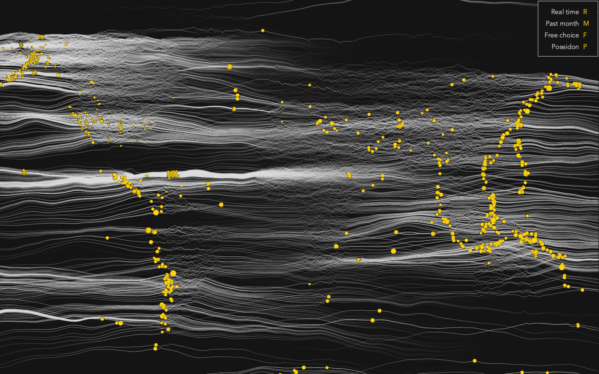

Live Earthquake Map is an interactive visualisation of USGS archive and real-time [earthquake data](https://earthquake.usgs.gov/earthquakes/).

This visualisation, built for a creative programming module at QMUL, displays the epicenters of recorded earthquakes in real time or between any range of dates.

Waves travel away from each epicenter and follow different algorithmic rules over land and water, allowing users to discern the shape of the continents and guess that it is indeed earthquakes that are being shown.

